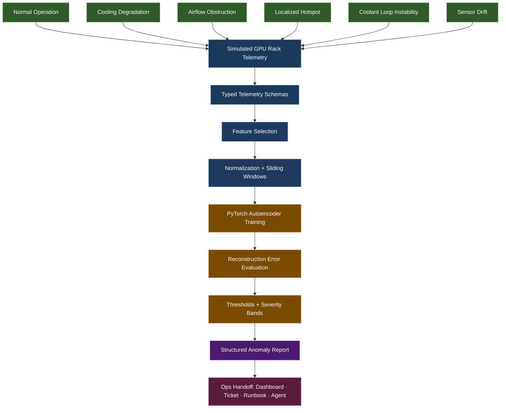

# GPU Rack Anomaly Detection in PyTorch

Public-safe portfolio project demonstrating anomaly detection for simulated
high-density GPU rack telemetry.

High-density AI compute environments depend on tightly controlled thermal,
airflow, power, and environmental conditions. This project shows how a small
PyTorch anomaly detection pipeline can turn simulated rack telemetry and
thermal-derived features into structured operations reports suitable for
monitoring, triage, or agentic infrastructure workflows.

All telemetry in this repository is simulated. The project does not model
proprietary datacenter designs, real facility layouts, vendor-specific control
loops, or raw thermal camera imagery.

## Architecture

This project is organized as a small operational ML pipeline. The model is only
one part of the system; the surrounding steps make the workflow repeatable,
testable, explainable, and suitable for downstream operations handoff.



Core modules:

- `schemas.py`: public-safe telemetry and report contracts
- `simulate_telemetry.py`: deterministic synthetic rack telemetry generation
- `features.py`: feature selection, standard scaling, windowing, and splits
- `model.py`: compact PyTorch window autoencoder and artifact utilities
- `train.py`: CPU-friendly training CLI
- `evaluate.py`: reconstruction-error evaluation CLI
- `infer.py`: deterministic anomaly report CLI

## Workflow Phases and Practical Value

1. Simulate telemetry

   The simulator creates repeatable GPU rack telemetry windows for normal
   operation and several generic environmental anomaly scenarios.

   Practical value: this makes the project testable without real facility data,
   vendor-specific rack details, or proprietary control logic. It also allows
   the same scenarios to be replayed during development, testing, and
   demonstrations.

2. Validate telemetry with typed schemas

   Telemetry samples and anomaly reports are represented with explicit
   contracts.

   Practical value: typed schemas make the boundary between data generation,
   model preparation, and operations output clear. In production systems, this
   kind of contract reduces ambiguity between sensors, ML pipelines, dashboards,
   and automation layers.

3. Prepare model-ready features

   Raw simulated telemetry is converted into stable feature columns, normalized,
   and grouped into sliding time windows.

   Practical value: anomaly detection depends on patterns over time, not just
   single readings. Windowing allows the model to learn relationships such as
   temperature drift, airflow instability, coolant behavior, and persistent
   thermal hotspots.

4. Train on normal operating behavior

   The PyTorch autoencoder is trained on normal rack behavior and learns to
   reconstruct expected telemetry patterns.

   Practical value: real infrastructure incidents are rare, unevenly labeled,
   and expensive to collect. Training on normal behavior is a practical approach
   for early anomaly detection when complete labeled failure datasets do not
   exist.

5. Evaluate reconstruction error

   Evaluation compares model reconstruction error against thresholds and
   produces structured metrics.

   Practical value: this separates model scoring from operational
   interpretation. Instead of treating the model as magic, the pipeline exposes
   measurable error, thresholds, severity bands, and per-window scores that can
   be reviewed and tuned.

6. Produce an operations-style anomaly report

   Inference emits a compact JSON report with anomaly score, severity, likely
   pattern, contributing signals, and a recommended action.

   Practical value: operations teams do not need raw tensors; they need clear
   signals that can drive triage. The final report is shaped for handoff to a
   dashboard, ticketing system, runbook workflow, or agentic operations layer.

## What This Demonstrates

- Practical PyTorch fluency without notebook-only implementation
- Production-minded project structure with CLI entry points and tests
- Public-safe simulation of operational telemetry patterns
- Deterministic preprocessing, training controls, and smoke-testable workflows
- Structured JSON outputs suitable for downstream automation or incident review
- Explainable heuristics layered on model reconstruction error

## Role of PyTorch

PyTorch is used for the trainable anomaly detection layer: defining the
autoencoder, training it on normal telemetry windows, running inference, and
measuring reconstruction error.

The rest of the project is intentionally framework-independent systems
engineering: telemetry simulation, typed schemas, feature preparation, windowing,
thresholding, severity mapping, explainable heuristics, CLI workflows, tests, and
structured JSON reports.

That separation is deliberate. In a production environment, the model
architecture could evolve, but the surrounding operational workflow would still
matter: trusted inputs, repeatable preprocessing, measurable outputs, and a clean
handoff path to dashboards, runbooks, tickets, or agent-assisted operations.

## Solution Architecture Lens

This project is not intended to be a novel datacenter cooling model or a
production-ready monitoring product. It is a compact demonstration of how I
approach AI-enabled infrastructure systems from first principles:

- Define the system boundary clearly
- Keep data contracts explicit
- Separate simulation, feature preparation, training, evaluation, and inference
- Produce structured outputs instead of informal console-only results
- Avoid hidden side effects or closed-loop control
- Preserve a clean path from model output to human or agent-assisted operations

That architecture matters because AI infrastructure monitoring is not just a
modeling problem. It is an operational trust problem: the system must explain
what it saw, why it matters, and how another workflow should safely consume the
result.

## What This Intentionally Does Not Include

- No raw thermal image processing
- No real datacenter telemetry, facility layout, or proprietary rack design data
- No vendor-specific cooling, power, or controls assumptions
- No web app, dashboard, or notebook workflow
- No claims that the simulated thresholds are production-ready
- No automated remediation or closed-loop control actions

## Telemetry Scope

Each simulated sample includes:

- GPU, inlet, outlet, coolant supply, and coolant return temperatures
- Airflow, humidity, rack power, and vibration
- Derived thermal-camera-style features
- A scenario label for simulation and testing

Thermal camera data is represented only as derived features:

- `thermal_hotspot_score`
- `thermal_gradient_score`
- `hotspot_persistence_seconds`

Supported simulated scenarios:

- `normal`
- `cooling_degradation`
- `airflow_obstruction`
- `localized_hotspot`
- `coolant_loop_instability`
- `door_open_containment_event`
- `sensor_drift`

## Install

Create a virtual environment:

```bash
python3 -m venv .venv
source .venv/bin/activate
python -m pip install --upgrade pip
```

Install the base package and test dependencies:

```bash
python -m pip install -e ".[dev]"
```

Install CPU-only PyTorch explicitly to avoid accidental CUDA wheel downloads:

```bash
python -m pip install torch --index-url https://download.pytorch.org/whl/cpu
python -m pip install numpy
```

The `ml` extra documents the ML dependency set, but on Linux, WSL, or CPU-only
systems, the explicit CPU PyTorch install above is recommended to avoid large
CUDA-enabled wheel downloads. If you already have a suitable PyTorch install,
`python -m pip install -e ".[dev,ml]"` is also supported.

## End-To-End Example

Generate telemetry, train on normal behavior, evaluate an anomalous window, and
produce an operational report:

```bash
gpu-rack-simulate \
  --scenario localized_hotspot \
  --window-size 60 \
  --seed 7 \
  --output examples/localized_hotspot_window.json

gpu-rack-train \
  --samples 240 \
  --window-size 24 \
  --stride 4 \
  --epochs 8 \
  --output-dir artifacts

gpu-rack-evaluate \
  --model artifacts/autoencoder.pt \
  --input examples/localized_hotspot_window.json \
  --output artifacts/evaluation.json

gpu-rack-infer \
  --model artifacts/autoencoder.pt \
  --input examples/localized_hotspot_window.json \
  --output artifacts/anomaly_report.json
```

The inference report includes:

- `rack_id`
- `anomaly_score`
- `severity`
- `likely_pattern`
- `contributing_signals`
- `recommended_action`

## Feature Preparation

```python
from gpu_rack_anomaly.features import (
    fit_standard_scaler,
    make_sliding_windows,
    normalize_features,
    telemetry_window_to_feature_matrix,
)
from gpu_rack_anomaly.simulate_telemetry import simulate_window

telemetry = simulate_window("normal", window_size=120, seed=7)
features = telemetry_window_to_feature_matrix(telemetry)
scaler = fit_standard_scaler(features)
normalized = normalize_features(features, scaler)
windows = make_sliding_windows(normalized, window_size=30, stride=5)
```

`windows.windows` is shaped as `[window, timestep, feature]` using plain Python
lists. The training code converts this structure to tensors internally.

## Outputs

Training writes:

- `artifacts/autoencoder.pt`
- `artifacts/metrics.json`

Evaluation emits structured JSON with reconstruction error statistics, severity
counts, thresholds derived from training metrics, and per-window scores.

Inference emits a compact anomaly report intended for operational triage. Pattern
classification uses deterministic, explainable heuristics over derived telemetry
features and reconstruction error. See
[Example Anomaly Report](docs/example_anomaly_report.md) for a human-readable
rendering of simulated report output.

## Tests

```bash
pytest
```

The tests cover schema validation, deterministic simulation, feature extraction,
normalization, sliding window generation, model forward pass, training smoke
tests, artifact creation, evaluation metrics, and inference reports.

## Future Work

- Additional derived thermal feature modeling with explicit privacy and safety
  boundaries
- Integration with real sensor streams or historical telemetry exports
- Dashboarding for anomaly trends, feature attribution, and rack-level drilldown
- Agentic operations handoff that converts reports into ticket drafts or runbook
  recommendations, without taking automated control actions
- Better threshold calibration using larger normal and anomalous validation sets
- Batch evaluation workflows for multiple racks and time ranges

## Related Projects

- [`iot-ops-agent`](https://github.com/JamesIOmete/iot-ops-agent) — autonomous AI agent for IoT fleet operations; the agentic operations handoff layer this project's anomaly reports are designed to feed into
- [`aws-iot-edge-reference`](https://github.com/JamesIOmete/aws-iot-edge-reference) — the IoT telemetry pipeline that produces the kind of structured sensor data this anomaly detection model consumes
- [`multicloud-sa-toolkit`](https://github.com/JamesIOmete/multicloud-sa-toolkit) — the cloud infrastructure layer where GPU rack monitoring systems would be deployed and operated
- [`k8s-inference-ops`](https://github.com/JamesIOmete/k8s-inference-ops) — Kubernetes deployment patterns for serving an inference API in the same telemetry domain; shows the deployment layer this pipeline's outputs would feed into

